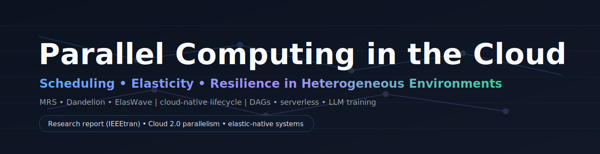

<p align="center">
  
</p>

# Parallel Computing in the Cloud  
### Scheduling, Elasticity, and Resilience in Heterogeneous Environments

**Author:** Andrew Photinakis  
**Affiliation:** Rochester Institute of Technology (RIT)  
**Format:** IEEEtran research report

---

## Overview

Cloud parallel computing has shifted from **static, homogeneous clusters** to **dynamic, heterogeneous, multi-tenant environments** where performance is shaped by:

- hardware heterogeneity (CPUs/GPUs/accelerators, mixed instance types)
- multi-tenant interference (“noisy neighbor” effects)
- complex application structures (microservices + DAG-based workflows)
- frequent faults at scale (fail-stop and fail-slow)
- cost/efficiency pressure (“elasticity” must be real, not aspirational)

This repository contains the paper:

> **Parallel Computing in the Cloud: Scheduling, Elasticity, and Resilience in Heterogeneous Environments**

The report synthesizes three representative systems—each aligned to a stage of the cloud-native lifecycle—to show why the future of cloud parallelism is **application-aware** and **elastic-native**, rather than POSIX-legacy.

---

## TL;DR

This report analyzes three systems that each tackle a major pillar of cloud-native parallelism:

- **MRS (MapReduce Scheduling):** Heterogeneity-aware scheduling via an explicit I/O interference model and geometric-interval scheduling.
- **Dandelion (Serverless Elasticity):** Microsecond “true elasticity” by redefining the execution interface and rejecting POSIX assumptions.
- **ElasWave (LLM Training Resilience):** Fault-tolerant hybrid parallelism via dynamic reshaping, fast communicator recovery, and consistency preservation.

**Core thesis:** Cloud-native parallel systems must move from legacy interfaces and batch assumptions toward **elastic-native designs** that minimize resource waste and recovery latency.

---

## What This Paper Contributes

### 1) A lifecycle lens for cloud parallelism
The paper frames parallelism across the **cloud-native lifecycle**:
- **Building** (packaging + artifact design)
- **Orchestration** (scheduling + placement under interference)
- **Operation** (autoscaling and elasticity limits)
- **Maintenance** (fault tolerance, recovery, resilience)

### 2) A comparative synthesis of three “cloud 2.0” pressures
- **Scheduling under interference** (I/O contention & heterogeneity)
- **True elasticity** (cold start vs. economic waste)
- **Resilience at scale** (LLMs as the new HPC workload)

### 3) A forward-looking architectural direction
The report argues that future systems will increasingly:
- abandon POSIX-bound assumptions (especially in serverless)
- become application-aware at the scheduler/runtime layer
- treat scaling and failure recovery as first-class, programmable behaviors

---

## Systems Analyzed

### MRS — Scheduling Under I/O Interference (MapReduce Era → Cloud Reality)
**Problem:** Classic FIFO/fair schedulers ignore cross-VM interference and create stragglers.  
**Idea:** Use a *white-box* interference model and schedule into **geometric time intervals** to reduce straggler impact.

**Key mechanisms:**
- explicit I/O interference model for task placement
- geometric interval discretization + list scheduling
- precedence-aware scheduling for Map → Reduce dependencies

**Takeaway:** Analytical heuristics can outperform naïve scheduling when the interference model is accurate, but MapReduce-era assumptions can clash with modern microservice/DAG workloads.

---

### Dandelion — True Serverless Elasticity (Reject POSIX, Gain Microseconds)
**Problem:** “Serverless” still wastes memory via warm sandboxes because cold starts are too slow.  
**Idea:** Redefine the execution interface and split compute from I/O so sandboxes can boot in microseconds.

**Key mechanisms:**
- **Coordinator + Engine** model (Compute Engines vs Communication Engines)
- shared-memory, user-space “zero-copy” channels
- isolation via language/hardware capability approaches instead of full POSIX VMs

**Takeaway:** Cold-start latency is largely an interface problem. True elasticity requires *elastic-native* execution models, at the cost of compatibility.

---

### ElasWave — Resilient LLM Training at Scale (Hybrid Parallelism + Fast Recovery)
**Problem:** LLM training runs for weeks across thousands of accelerators—failures are inevitable.  
**Idea:** Recover **in-place** without full restarts by dynamically reshaping the hybrid-parallel computation.

**Key mechanisms:**
- multi-dimensional scheduling (dataflow + graph + hardware dimensions)
- fast membership repair via dynamic communicators
- computation consistency via RNG resharding
- overlapping communication/computation during parameter migration

**Takeaway:** The future of HPC-in-the-cloud is resilience-first. Checkpoint/restart alone is too slow at modern scale.

---

## Key Themes & Conclusions

### Cloud heterogeneity breaks legacy scheduling assumptions
Schedulers must incorporate real-world interference and device variance.

### Elasticity is not “autoscaling”; it’s eliminating waste
If cold starts are slow, the platform must keep warm capacity, undermining the economics.

### Resilience is now a baseline requirement, not a feature
At LLM scale, failures are routine; recovery must be fast and continuous.

### The trajectory is “application-aware + elastic-native”
Future systems will increasingly co-design:
- runtimes
- schedulers
- execution interfaces
around the application’s structure and scaling/failure semantics.

## Suggested GitHub Topics

`cloud-computing`, `parallel-computing`, `scheduling`, `serverless`, `elasticity`,
`fault-tolerance`, `distributed-systems`, `cloud-native`, `llm-training`,
`heterogeneous-computing`, `mapreduce`, `microservices`, `dag-scheduling`

---

## Citation

```bibtex
@techreport{photinakis2025parallelcloud,
  title={Parallel Computing in the Cloud: Scheduling, Elasticity, and Resilience in Heterogeneous Environments},
  author={Photinakis, Andrew},
  institution={Rochester Institute of Technology},
  year={2025}
}
```

---

## Contact

**Andrew Photinakis**
[acp7795@rit.edu](mailto:acp7795@rit.edu)
Rochester Institute of Technology
